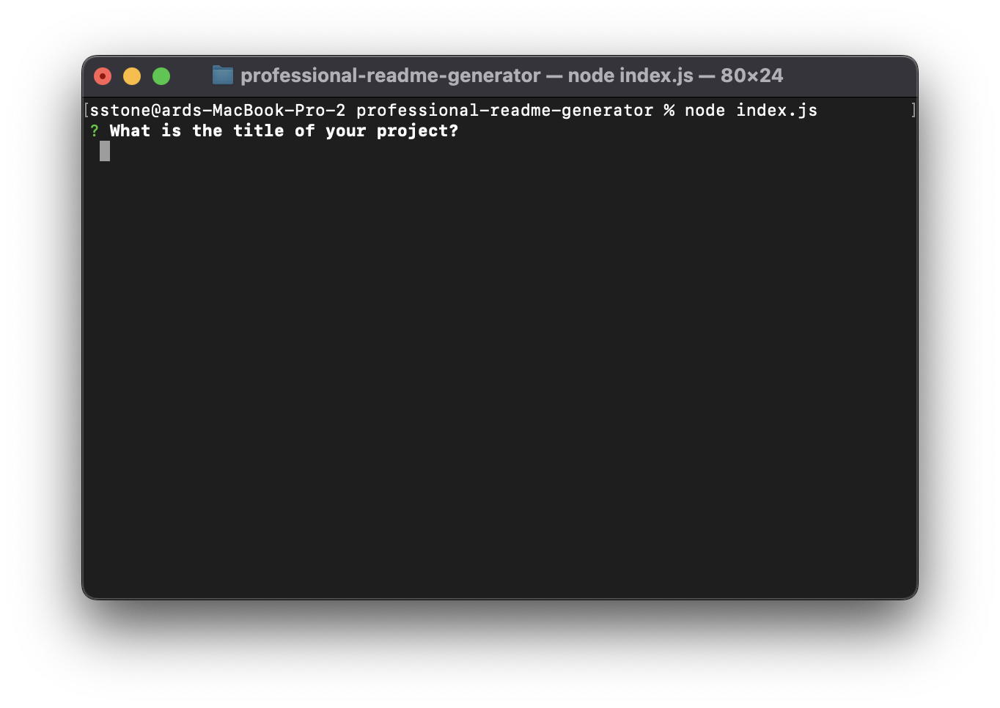
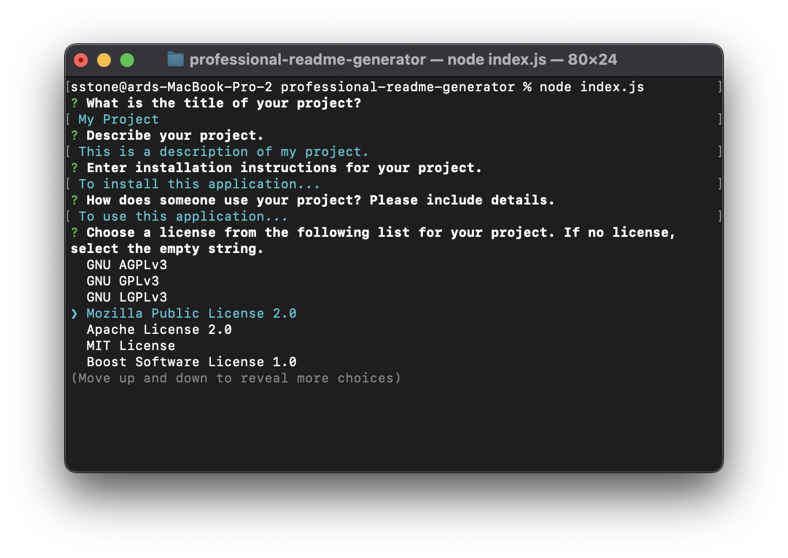
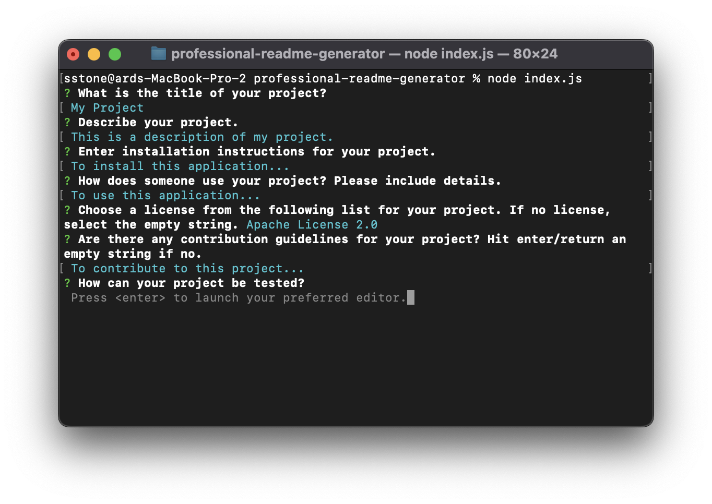
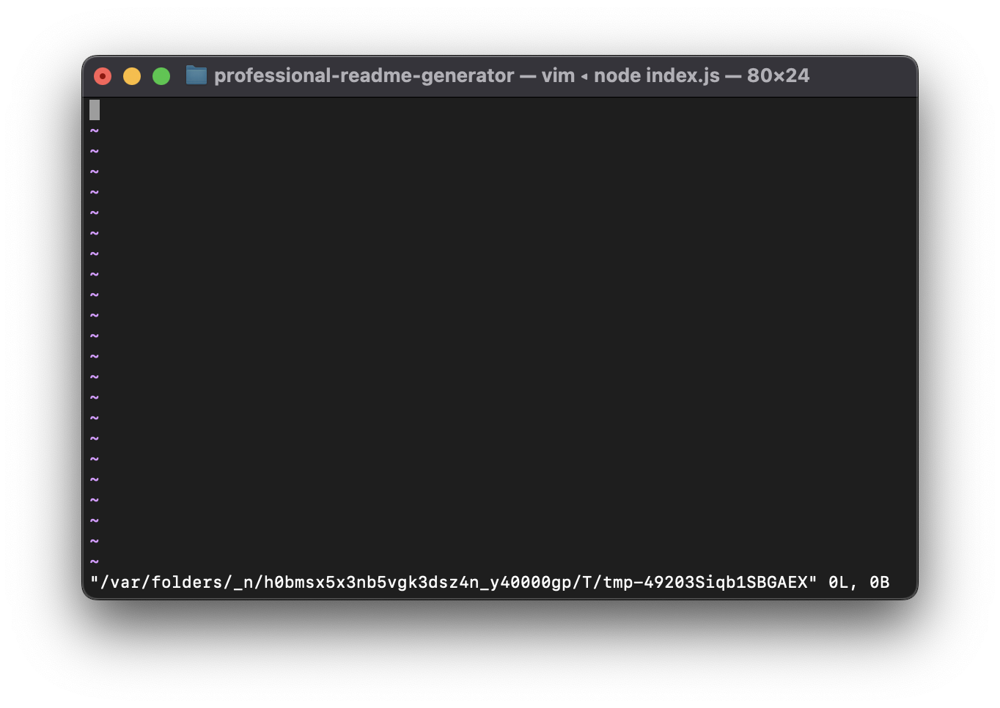
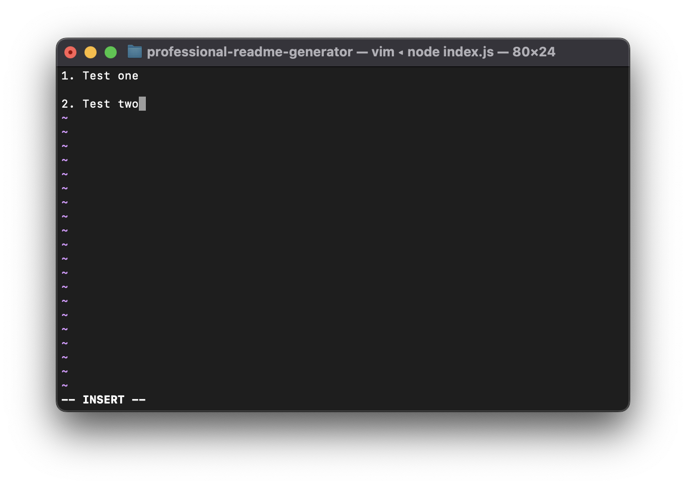
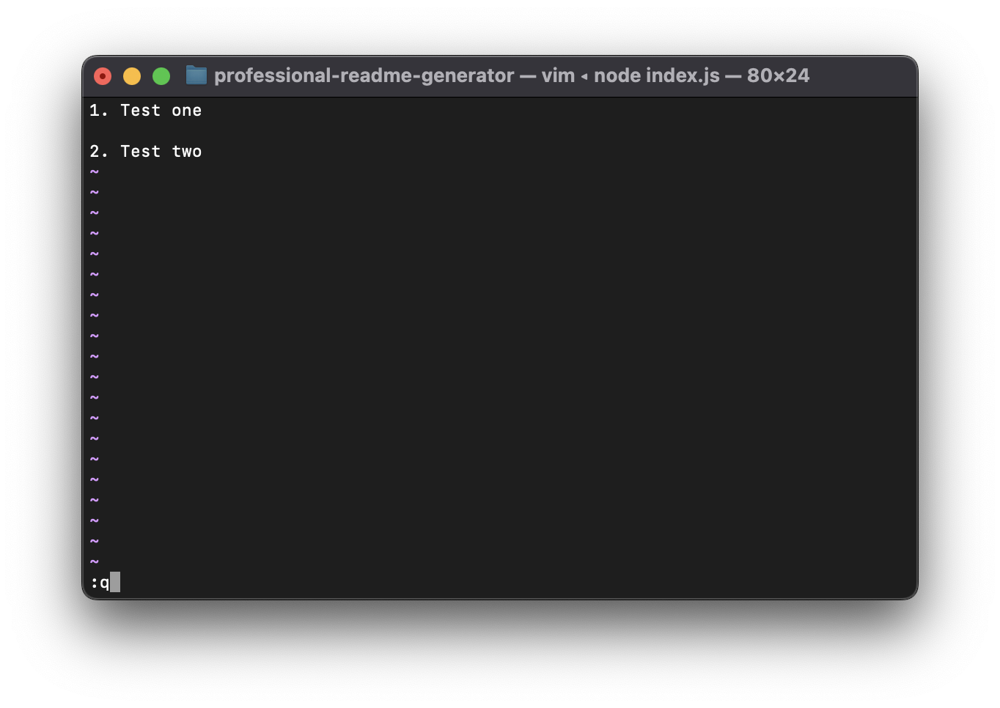
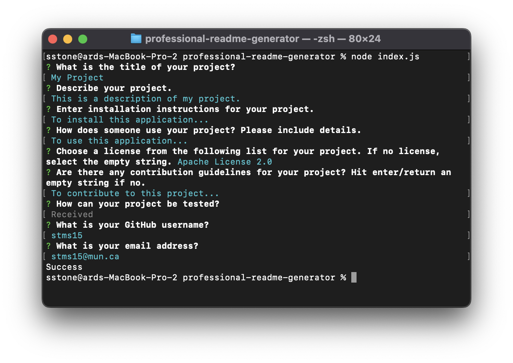
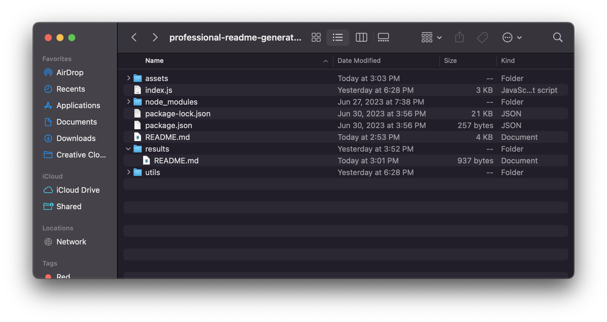

# Professional README Generator

## Description

The Professional README Generator creates a README.md file using the typical structure and user input for specific sections.

This project uses the Inquirer package to prompt the user for input in the command line. A serious of questions are displayed one-by-one and the response to each question is recorded. This data is then passed to the `generateMarkdown` function to create the README file in the markdown language. Each response is added to the base layout of a README file in the appropriate section.

Additionally, if a license is chosen (not an empty string), then a badge for that license is generated and placed at the top of the README. The License section is also populated with the license name and a link to that license's details.

The generated markdown is stored as a string and then written to a file titled "README.md" in the "results" folder using the `fs` library.

The goal of the project was to make generating a quality README easier and faster. No knowledge of the markdown language is required to use this applciation to get a README.md file.

While working with the Inquirer library, I learned that there are different types of prompts including a "list" which was used in this project to present the user with a list of licenses they can choose from. I am also now more familiar with node and working in the terminal.

## Table of Contents

- [Installation](#installation)
- [Usage](#usage)
- [Credits](#credits)
- [License](#license)

## Installation

To install this application, follow these steps:

1. Download the set of files and folders in the <a href="https://github.com/stms15/professional-readme-generator">GitHub repo</a>. The minimum requirements are `index.js`, `utils`, `package.json`, and `package-lock.json`.

2. Open your terminal or a text editor with a terminal and navigate to the folder with the application files.

3. Run `node i` or `node install` to install all of the required packages listed in the `package.json` file.

4. Now you're ready to use the application. Enter `node index.js` to run.

## Usage

To use this application, follow the instructions in the [Installation](#installation) section and run `node index.js` in the command line. You should see something like this.

Answer each prompt in the terminal. Note that clicking "enter" or "return" will submit your response and the program will move on to the next prompt. When you're prompted to choose a license, a list of options will display in the terminal. You can use the arrow keys to navigate the list. Then click "enter" when the text is blue and the arrow on the left-hand side is next to the option you wish to choose.

To answer the prompt for possible tests, the terminal will request to open your default text editor in the terminal.

Click enter and you should see something similar to this.

To start writing text, press "i" and then type as normal. You should see "-- INSERT --" on the bottom of the window. Note that in the editor, you can use "enter" to write text on different lines.

When you're finished, click "esc" and then ":w" to write your changes to a temporary file.

To quit, enter ":q". The data written to the temporary file will be passed to the application as the response to the question. The file will not be saved.

After you answer all prompts, you should see a "Success" message and the application will have completed execution.

You can then find the resulting "README.md" file in the "results" folder.

For a complete video tutorial on how to run this application and properly answer the prompts, please reference https://drive.google.com/file/d/1Y6dg8q3Mcm7jMeNizj7Pb8_7QUrRlh6X/view?usp=drive_link.

## Credits

This project uses the Inquirer library. Documentation for this can be found here: https://www.npmjs.com/package/inquirer.

The fs library is also used and documentation can be found here: https://www.npmjs.com/package/fs.

## License

For more information about this license, please visit https://spdx.org/licenses/MIT.html.

---

## Badges

## Tests

- To test the application, enter `node index.js` in the command line to run it.

- Answer each prompt with test information. This can just be a sentence or a word for testing.

- Select a license from the provided list. To fully test, you can do this process twice and choose a license one time and the empty string the other time. This will ensure that the badge and License section are generated when a license is chosen, but nothing is populated when the empty string is chosen.

- Enter a valid GitHub username and email.

- If a "success" message is printed to the terminal, then no errors occured. To ensure the file was generated as expected, check that the "README.md" file in the "results" folder contains the expected information and that the links are working properly.
